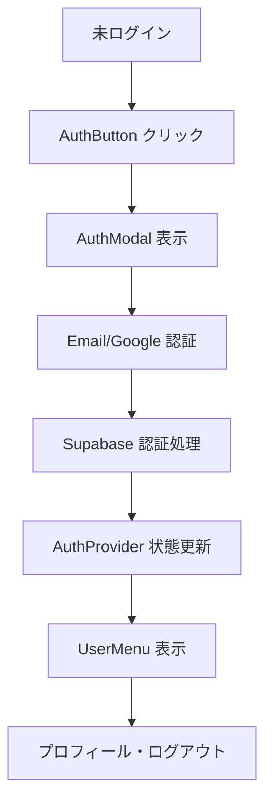
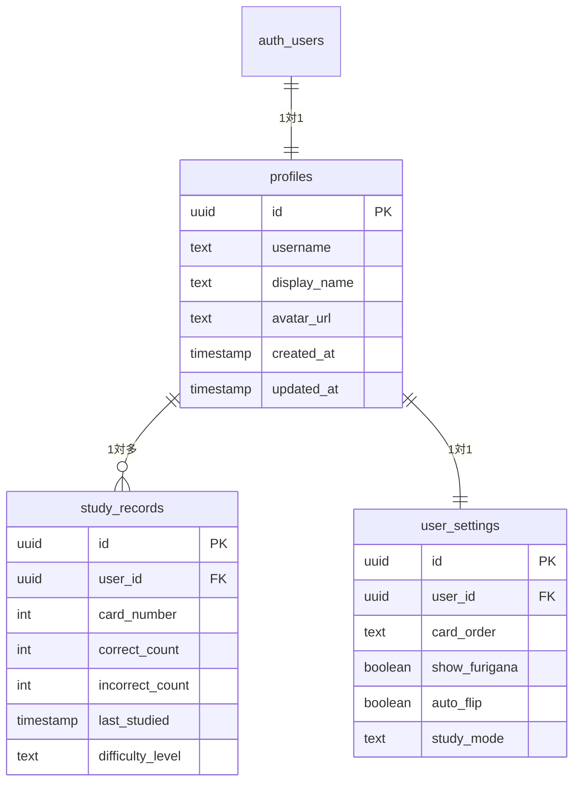

# 🚀 Phase 3 開発進捗レポート

## 📊 全体進捗状況
```
Phase 3.1: Supabase基盤構築     ████████████████████ 100%
Phase 3.2: 認証システム実装     ████████████████████ 100%
Phase 3.3: 仮想スクロール実装   ░░░░░░░░░░░░░░░░░░░░   0%
Phase 3.4: 学習機能統合         ░░░░░░░░░░░░░░░░░░░░   0%
Phase 3.5: リアルタイム機能     ░░░░░░░░░░░░░░░░░░░░   0%

全体進捗: ████████░░░░░░░░░░░░ 40%
```

## ✅ 完了済み機能

### 🏗️ Phase 3.1: Supabase基盤構築
- [x] **ライブラリ統合** - @supabase/supabase-js + 関連パッケージ
- [x] **データベース設計** - PostgreSQL スキーマ完備
  ```sql
  profiles (ユーザープロファイル)
  study_records (学習記録)  
  user_settings (ユーザー設定)
  ```
- [x] **型定義** - TypeScript完全対応
- [x] **RLS設定** - Row Level Security完備
- [x] **ヘルパー関数** - CRUD操作・リアルタイム購読

### 🔐 Phase 3.2: 認証システム実装
- [x] **AuthProvider** - 認証状態グローバル管理
- [x] **AuthModal** - ログイン・新規登録UI
- [x] **UserMenu** - ユーザーメニュー・プロフィール
- [x] **AuthButton** - Header統合済み
- [x] **OAuth対応** - Google認証 + Email認証
- [x] **コールバック処理** - 認証完了後のルーティング

## 📁 ファイル構造

```
📦 Phase 3 新規ファイル
├── 📂 src/lib/
│   └── 📄 supabase.ts              # Supabaseクライアント設定
├── 📂 src/types/
│   └── 📄 database.ts              # データベース型定義
├── 📂 src/components/auth/
│   ├── 📄 AuthProvider.tsx         # 認証プロバイダー
│   ├── 📄 AuthModal.tsx           # ログインモーダル
│   ├── 📄 UserMenu.tsx            # ユーザーメニュー
│   └── 📄 AuthButton.tsx          # 認証ボタン
├── 📂 src/pages/auth/
│   └── 📄 callback.tsx             # OAuth コールバック
├── 📂 src/hooks/
│   └── 📄 useSupabase.ts           # DB操作カスタムフック
├── 📄 supabase-schema.sql          # データベーススキーマ
├── 📄 .env.local.example           # 環境変数テンプレート
├── 📄 .env.local                   # 環境変数設定
└── 📄 Phase3開発計画.md            # 開発計画書
```

## 🔧 技術スタック

### フロントエンド
- ✅ React 18 + TypeScript
- ✅ Redux Toolkit (状態管理)
- ✅ Tailwind CSS (スタイリング)
- ⏳ React Window (仮想スクロール) - 準備完了

### バックエンド
- ✅ Supabase (BaaS)
- ✅ PostgreSQL (データベース)
- ✅ Row Level Security (セキュリティ)
- ✅ Realtime Subscriptions (リアルタイム)

### 認証
- ✅ Email認証
- ✅ Google OAuth
- ✅ セッション管理
- ✅ ユーザープロファイル

## 📈 実装済み機能詳細

### 🎯 認証フロー


### 🗄️ データベース構造


## 🎯 次のマイルストーン

### 🔄 Phase 3.3: 仮想スクロール実装 (次のタスク)
```
優先度: HIGH
期間: 1-2日
目標: 100首の高速表示・スムーズスクロール

実装予定:
□ MemoGrid の react-window 統合
□ カード高さ動的計算
□ スクロール位置記憶
□ パフォーマンス最適化
```

### 📊 Phase 3.4: 学習機能統合
```
優先度: MEDIUM  
期間: 2-3日
目標: 学習進捗記録・統計表示

実装予定:
□ 学習記録保存機能
□ 正答率・学習時間統計
□ 進捗グラフ表示
□ 苦手カード識別
```

### 🌐 Phase 3.5: リアルタイム機能
```
優先度: LOW
期間: 1-2日  
目標: デバイス間同期・オフライン対応

実装予定:
□ リアルタイム同期
□ オフライン検知
□ データ競合解決
□ 同期状態表示
```

## 📋 開発環境状況

### ✅ 準備完了
- Git ブランチ: `feature/phase3-development`
- ビルド状態: ✅ 成功 (404.36 kB)
- TypeScript: ✅ エラーなし
- 依存関係: ✅ 最新

### ⚠️ 要対応
- Supabase プロジェクト作成 (Webコンソール)
- 環境変数設定 (.env.local)
- 初回認証テスト

## 🎉 Phase 3 の価値

### Before (Phase 2)
```
- ローカルストレージのみ
- 単一デバイス限定
- 学習記録なし
- ユーザー管理なし
```

### After (Phase 3 完成時)
```
- クラウドデータベース
- マルチデバイス対応
- 詳細学習記録・統計
- ユーザープロファイル
- リアルタイム同期
- 仮想スクロール対応
```

---

**現在の状況**: Phase 3 の 40% 完了、順調に進行中！
**次のアクション**: 仮想スクロール実装で性能向上を図る